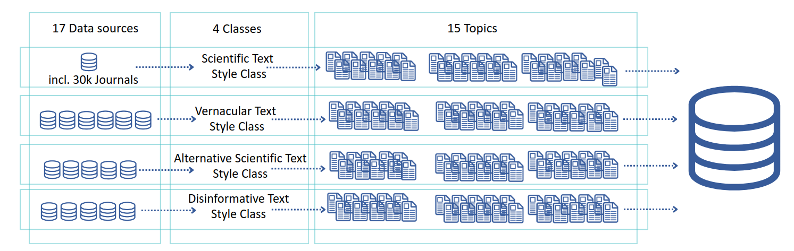
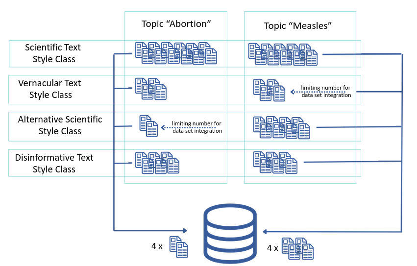

# FourShadesofLifeSciences

Material related research articles "Four Shades of Life Sciences: A dataset for disinformation detection in the Life Sciences"

---

## Abstract 
Beyond the political sphere, the proliferation of disinformation within the fields of medical and life sciences presents a significant challenge to public health. Disinformation is characterized by the incorrectness of information, as well as by the intention to spread the false information. Research attempts to address the issue of incorrectness by automating fact-checking, which comes with several difficulties when applied to research texts. 
The work presented in the article focuses on the intention rather than the fact-checking. Since disinformation follows goals such as making money, gaining attention, or discrediting a competitor, the language style is shaped by these goals. 
State-of-the-art machine learning techniques offer potential solutions to address or mitigate this issue, including methods such as text classification. The development of robust text classification methodologies requires high-quality data sets for training and evaluation. Currently, there are few comprehensive datasets for full-text life sciences with respect to disinformation. In general, the data sets focus on fact-checking short statements which refer to misinformation. To our knowledge, the approach to include the intention has not yet been addressed  by research.   
In this context, we introduce a novel labeled dataset, "Four Shades of Life Sciences". 
This categorization uniquely differentiates various levels of information accuracy beyond a simple binary distinction between disinformation and non-disinformation, enabling a more nuanced analysis based on semantic classification rather than fact-checking.
The data set was compiled in 2024. It contains a total of 2633 items.

AQUAS at [ZB MED](https://www.zbmed.de/forschen/laufende-projekte/aquas/)

## Webservice
Here you find a web service: https://fsols.zbmed.de/

## Publication Reference
Soon you find our first publication here: 	
Eva Seidlmayer, Lukas Galke, Konrad U. Förstner: Four Shades of Life Sciences: A Dataset for Disinformation Detection in the Life Sciences, arXiv preprint [https://www.arxiv.org/abs/2507.03488](https://www.arxiv.org/abs/2507.03488)

## Dataset
You will soon be able to find the parts of the data set under open license here: < Zenodo >.
Scientific Text Data: PubMed Central
Alternative Scientific Text Data :
- BMC Complementary Medicine and Therapies: "(...) we will apply a Creative Commons licence allowing re-use of the article by third parties for particular purposes."
- International Journal of Homoeopathic Journal: CC BY-NC License
- Indian Journal of Research in Homeopathy: CC BY NC DD 4.0 License 
- The Journal of Evidence-Based Integrative Medicine (JEBIM): "Manuscript content on this site is licensed under Creative Commons Licenses"

- -> only Anthroposophic Goetheaneum List has different licenes

| category            | data source                                         | amount         |
|---------------------|-----------------------------------------------------|----------------|
| scientific          |||
|                     | Pubmed Central (PMC)                                | 687            |
|           |                                                     | total: 687     |
| ----- | -----  | -----  |
| alternative         |||
|                     | Complementary Medicine and Therapies                | 309            |
|                     | Indian Journal of Research in Homeopathy            | 10             |
|                     | International Journal of Homoeopathic Sciences      | 138            |
|                     | Goetheaneum List                                    | 17             |
|                     | The Journal of Evidence-Based Integrative Medicine  | 193            |
|                     |                                                     | total: 667     |
| -----               | -----   | -----  |
| vernacular          |||
|                     | Harvard Health Publishing                           | 116            |
|                     | Mayo Clinic                                         | 17             |
|                     | Medline Plus                                        | 121            |
|                     | Men's Health                                        | 115            |
|                     | WebMD                                               | 238            |
|                     | Women's Health                                      | 108            |
|           |                                                     | total: 715     |
| -----               | -----  | ----- |
| disinformative      | ||
|                     | Dr. Mercola's Cenored Library                       | 137            |
|                     | Health.News                                         | 20             |
|                     | Health Impact News                                  | 175            |
|                     | Info Wars                                           | 12             |
|                     | Natural News                                        | 190            |
|                     |                                                     | total: 534     |
| -----               | ----- | ----- |
| complete data set   |                                                     | total: 2603    |

### Compiling Data
#### Alternative Scientific Text Data
- Anthroposophic Goetheaneum List:  
  - **topics needs to be assigned afterwards**
  - URLs: urls_anthroposophic_goetheaneum.csv: URLs mentioned in Physicians' Association for Anthroposophic Medicine (PAAM, https://anthroposophicmedicine.org/)
   as well as in: literature lists 2017-2020 Anthroposophic Medicine School of Spiritual Science Medical Section at the Goetheanum (https://medsektion-goetheanum.org/en/research/publications/journal-contributions-on-research-in-anthroposophic-medicine-2017-2019)
  - HARVESTING: harvest_anthroposophic_goetheaneumlist_PDFs.py: For harvesting PDFs from URLS
- BMC Complementary Medicine and Therapies: https://bmccomplementmedtherapies.biomedcentral.com/, ISSN: 2662-7671
  - URLs: urls_complementarymedicineandtherapies.csv: URLS from BMC Complementary Medicine and Therapies
  - HARVESTING: harvest_complementarymedandtherapies.py: Retrieve text from PDF-URLs BMC Complementary Medicine and Therapies
- International Journal of Homoeopathic Sciences: https://www.homoeopathicjournal.com, ISSN: 2616-4485
  - **topics needs to be assigned afterwards**
  - URLs: urls_homeopathicjournal.csv
  - HARVESTING: harvest_homeopathicjournal_PDFs.py
- Indian Journal of Research in Homeopathy: https://www.ijrh.org/journal/, ISSN 0974-7168
  - URLs and HARVESTING: URLs can directly harvested from website: harvest_Indian-research-Homeoathy_PDFs.py
- The Journal of Evidence-Based Integrative Medicine (JEBIM) is a peer-reviewed open access journal which focuses on hypothesis-driven and evidence-based research in all fields of integrative medicine. Previously the Journal of Evidence-Based Complementary and Alternative Medicine (JEBCAM), https://journals.sagepub.com/home/CHP , ISSN: 2515-690X
  - URLs: urls_sagejournalsofevidencebasedintegrativemedicine.csv
  - HARVESTING: harvest_sagejournalsofevidencebasedintegrativemedicine.py
  - 
#### Disinformative Text Data
- Dr. Mercola's Censored library: https://www.mercola.com/
  - **Internet archive set-up missed so far** 
    - URLs: urls_Mercola.csv
    - HARVESTING: harvest_Mercola.py
- Health.News
  - URLs:  urls_HealthNews.csv
  - HARVESTING: harvest_HealthNews.py
- Health Impact News
  - URLs:  urls_HealthImpactNews.csv
  - HARVESTING: harvest_HealtImpactNews.py
- Infowars: https://www.infowars.com/category/4/ only "health" category
  - URLs:  urls_Infowars.csv
  - HARVESTING: harvest_Infowars.py
- Natural News: https://www.naturalnews.com/
  - URLs: urls_NaturalNews.csv 
  - HARVESTING: harvest_NaturaNews.py

#### Scientific Text Data
- PubMed Central:
  - Dementia [C10.228.140.380, F03.615.400] 
  - Myocardial Infarction [C14.280.647.500, C14.907.585.500, C23.550.513.355.750, C23.550.717.489.750]
  - Sleep Initiation and Maintenance Disorders [C10.886.425.800.800, F03.870.400.800.800]
  - Menopause [G08.686.157.500, G08.686.841.249.500]
  - Stroke [C10.228.140.300.775, C14.907.253.855]
  - Tobacco Use [F01.145.958] / Tobacco Smoking [F01.145.805.375,  F01.145.958.875]
  - Curcuma [B01.875.800.575.912.250.618.937.900.166]
  - Measles [C01.925.782.580.600.500.500]
  - Inflammation [C23.550.470]
  - Vaccines [D20.215.894]
  - Abortion, Induced [E04.520.050]
  - Climate change  [G16.500.175.374]
  - Pandemics [N06.850.290.200.600]
  - Urine [A12.207.927]

    - HARVESTING: 
      1) get all PMIDS related to a MESH term: harvest_PMC_by_MESH.py 
      2) compile files to one and delete empty texts: harvest_PMC_PMID-to-txt.py
    - HARVESTING 10% most cited papers: 
      1) get all PMIDS related to a MESH term: harvest_PMC_citation-freq_topicwise.py"
      2) harvest citations from Open citations and calculate the ten percent most cited: harvest_PMC_citation-freq_Opencitations_for-citation.py
      3) get text for ten percent most cited: harvest_PMC_citation-freq_PMID-to-txt.py
      4) compile files to one and delete empty texts: compile_PMC_citation-freq_data.py

#### Vernacular Text Data
- Harvard Health Publishing: https://www.health.harvard.edu/ webpage with patient information
  - URLs:  urls_HarvardHealthPublishing.csv
  - HARVESTING: harvest_HarvardHealthPublishing.py
- Mayo Clinic: https://www.mayoclinic.org/drugs-supplements webpage with information on drugs and supplements
  - URLs:  
  - HARVESTING: 
- Medline Plus Magazine: https://magazine.medlineplus.gov
  - URLs:  urls_MedlinePlus.csv
  - HARVESTING: harvest_MedlinePlus-content.py
- Men's Health: https://www.menshealth.com webpage with lifestyle information
  - URLs:  urls_MensHealth.csv
  - HARVESTING: harvest_MensHealth.py
- WebMD:  https://www.webmd.com webpage with patient information
  - URLs:  urls_WebMD.csv
  - HARVESTING: harvest_WebMD_website.py
- Women's Health: https://www.womenshealthmag.com webpage with lifestyle information
  - URLs:  urls_WomensHealth.csv
  - HARVESTING: harvest_WomensHealth.py

  

## Code
 see this repoitory: 

## Responsible
Eva Seidlmayer, Dr. phil., M.LIS  
Data Sciences and Services, Research Fellow  
ORCID: 0000-0001-7258-0532  
Mastodon: @eta_kivilih@eldritch.cafe | Bluesky: @etakivilih.bsky.social  
 
ZB MED – Information Centre for Life Sciences  
Gleueler Straße 60  
50931 Cologne  
Germany  
 
[www.zbmed.de](www.zbmed.de)  
INFORMATION. KNOWLEDGE. LIFE.

## Funding
DFG-LIS: FO 984/6-1

## License
>>>>>>> 16abf1e4419ea0c154748f0336cf3138056dc945
Copyright (c) 2025 Eva Seidlmayer

Permission is hereby granted, free of charge, to any person obtaining a copy of this software and associated documentation files (the "Software"), to deal in the Software without restriction, including without limitation the rights to use, copy, modify, merge, publish, distribute, sublicense, and/or sell copies of the Software, and to permit persons to whom the Software is furnished to do so, subject to the following conditions:

The above copyright notice and this permission notice shall be included in all copies or substantial portions of the Software.

THE SOFTWARE IS PROVIDED "AS IS", WITHOUT WARRANTY OF ANY KIND, EXPRESS OR IMPLIED, INCLUDING BUT NOT LIMITED TO THE WARRANTIES OF MERCHANTABILITY, FITNESS FOR A PARTICULAR PURPOSE AND NONINFRINGEMENT. IN NO EVENT SHALL THE AUTHORS OR COPYRIGHT HOLDERS BE LIABLE FOR ANY CLAIM, DAMAGES OR OTHER LIABILITY, WHETHER IN AN ACTION OF CONTRACT, TORT OR OTHERWISE, ARISING FROM, OUT OF OR IN CONNECTION WITH THE SOFTWARE OR THE USE OR OTHER DEALINGS IN THE SOFTWARE.
